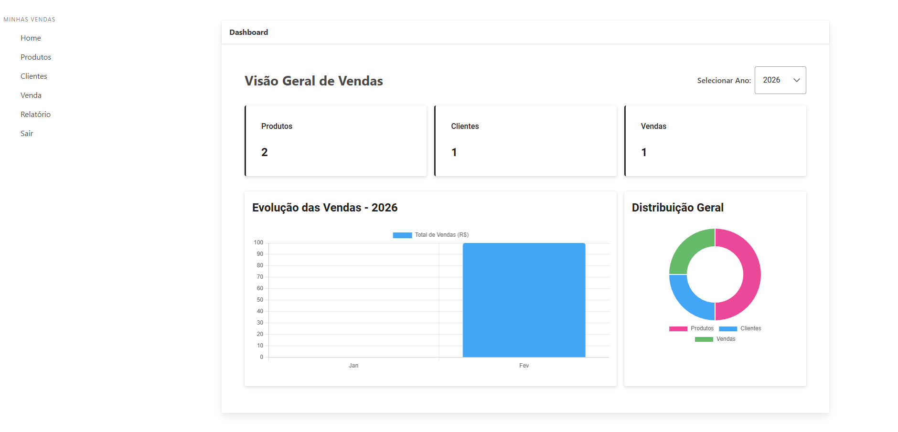
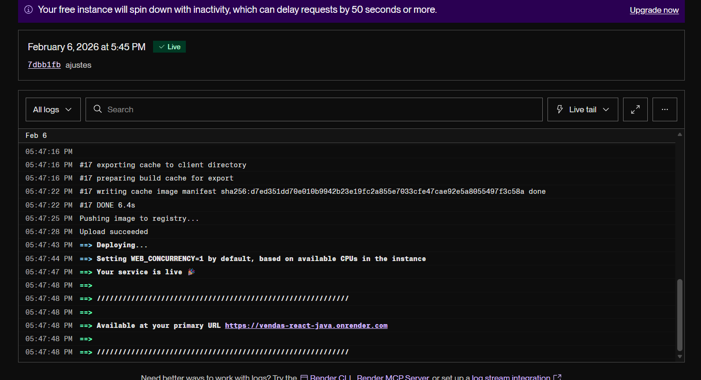

# 🛒 Sistema de Vendas Full Stack - Portfólio

# 🛒 Sistema de Vendas Full Stack - Portfólio

Este repositório contém um ecossistema completo de gestão de vendas, integrando uma API robusta em **Java/Spring Boot** com um frontend moderno e responsivo em **React/Next.js**. O projeto foi arquitetado para demonstrar competências em desenvolvimento full stack, segurança (OAuth2) e infraestrutura em nuvem.

## 🔗 Links do Projeto
* **Aplicação Live:** [vendas-react-java.vercel.app](https://vendas-react-java.vercel.app)
* **API em Produção:** [vendas_react_java.onrender.com](https://vendas_react_java.onrender.com)

## 📂 Estrutura do Repositório
* **`/backend`**: API Spring Boot com integração JasperReports e PostgreSQL.
* **`/frontend`**: Aplicação Next.js com PrimeReact e autenticação social.
* **`/screenshots`**: Documentação visual das funcionalidades e dashboards.

## 🛠️ Tecnologias e Funcionalidades

### **Backend (Java / Spring Boot)**
* **JasperReports**: Geração de relatórios de vendas consolidados em PDF.
* **PostgreSQL**: Banco de dados relacional com suporte a buscas insensíveis a acentos via extensão `unaccent`.
* **Spring Data JPA**: Abstração de persistência de dados para maior eficiência.

### **Frontend (React / Next.js)**
* **Auth0 & GitHub Login**: Autenticação social segura e simplificada.
* **PrimeReact**: UI Kit para uma interface de usuário profissional e consistente.
* **Vercel Analytics**: Monitoramento em tempo real de performance e tráfego.

## 📸 Demonstração Visual

### Dashboard do Sistema

### Monitoramento de Infraestrutura (Render)

## 🧠 Desafios Técnicos Superados

1.  **Habilitação de Extensões em DB Gerenciado**: Configuração manual da extensão `unaccent` no PostgreSQL do Render para permitir filtros de busca otimizados.
2.  **Fluxo de Autenticação em Produção**: Ajuste dinâmico de *Callback URLs* no Auth0 e GitHub para suportar o domínio da Vercel.
3.  **Manipulação de Blobs**: Tratamento de respostas binárias da API para abertura instantânea de relatórios Jasper no navegador.

---
Desenvolvido por **Vinícius Nunes** [LinkedIn](https://www.linkedin.com/in/vinicius-nunes-322583216/) | [GitHub](https://github.com/ViniciusNunes01)
